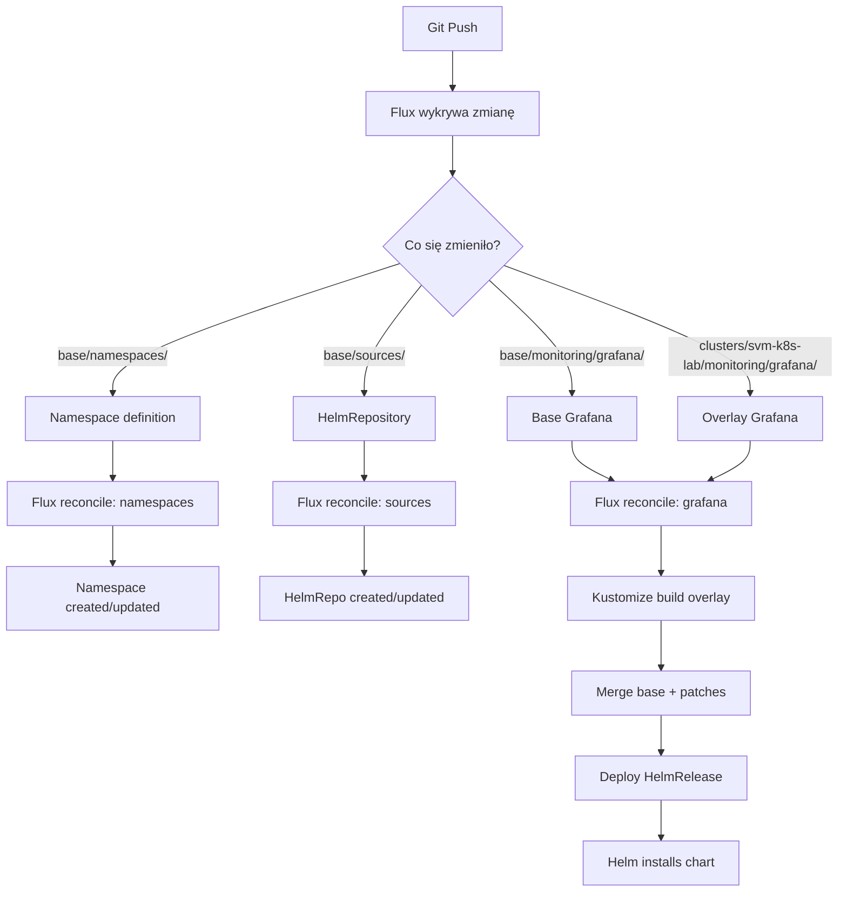

# Struktura Repozytorium - Base + Overlays (Zgrupowana)

## 📊 Architektura

Ta repozytorium używa wzorca **Base + Overlays** Kustomize z **logicznym grupowaniem aplikacji** dla multi-cluster deployments.

```
base/
├── namespaces/              ← Deduplikowane namespaces
├── sources/                 ← HelmRepositories
├── monitoring/              ← Grupa aplikacji
│   ├── grafana/
│   └── alloy/
└── network/                 ← Grupa aplikacji
    └── nginx/

clusters/[name]/
├── namespaces-kustomization-flux.yaml
├── sources/
├── monitoring/              ← Grupa overlays
│   ├── grafana/
│   └── alloy/
└── network/                 ← Grupa overlays
    └── nginx/
```

## 🗂️ Szczegółowa Struktura

```
external-lab-k8s/
│
├── base/                                  # 📦 Bazowe definicje (multi-cluster)
│   │
│   ├── namespaces/                       # Deduplikowane namespaces
│   │   ├── kustomization.yaml
│   │   ├── monitoring.yaml              # Namespace 'monitoring'
│   │   └── network.yaml                 # Namespace 'network'
│   │
│   ├── sources/                          # HelmRepositories
│   │   ├── kustomization.yaml
│   │   ├── helmrepo-grafana.yaml
│   │   └── helmrepo-nginx.yaml
│   │
│   ├── monitoring/                       # 📊 Grupa: Monitoring
│   │   │
│   │   ├── grafana/                     # Grafana base
│   │   │   ├── kustomization.yaml      # Lista resources (bez namespace.yaml)
│   │   │   └── helmrelease.yaml        # HelmRelease z default values
│   │   │
│   │   └── alloy/                       # Alloy base
│   │       ├── kustomization.yaml
│   │       └── helmrelease.yaml
│   │
│   └── network/                          # 🌐 Grupa: Network
│       │
│       └── nginx/                        # NGINX base
│           ├── kustomization.yaml
│           ├── rbac.yaml                # ServiceAccount + RBAC
│           └── helmrelease.yaml
│
└── clusters/
    └── svm-k8s-lab/                     # 🎯 Cluster-specific config
        │
        ├── flux-system/                 # Flux components (managed by Flux)
        │   ├── gotk-components.yaml
        │   ├── gotk-sync.yaml
        │   └── kustomization.yaml
        │
        ├── namespaces-kustomization-flux.yaml  # Flux Kustomization dla namespaces
        │
        ├── sources/                     # Overlay dla HelmRepositories
        │   ├── kustomization.yaml            # resources: - ../../../base/sources
        │   └── kustomization-flux.yaml       # Flux Kustomization CRD
        │
        ├── monitoring/                  # 📊 Grupa: Monitoring overlays
        │   │
        │   ├── grafana/                 # Overlay dla Grafana
        │   │   ├── kustomization.yaml        # resources: - ../../../../base/monitoring/grafana
        │   │   │                              # patches: - patches.yaml
        │   │   ├── patches.yaml              # Strategic merge dla HelmRelease
        │   │   │                              # (cluster-specific values)
        │   │   └── kustomization-flux.yaml   # Flux Kustomization CRD
        │   │
        │   └── alloy/                   # Overlay dla Alloy
        │       ├── kustomization.yaml
        │       ├── patches.yaml
        │       └── kustomization-flux.yaml
        │
        └── network/                     # 🌐 Grupa: Network overlays
            │
            └── nginx/                   # Overlay dla NGINX
                ├── kustomization.yaml
                ├── patches.yaml
                └── kustomization-flux.yaml
```

## 🔄 Przepływ Deployment



## 📋 Typy Plików

### 1. Namespaces (base/namespaces/)

**Deduplikowane namespaces** - jeden plik na namespace niezależnie od liczby aplikacji.

#### base/namespaces/monitoring.yaml
```yaml
apiVersion: v1
kind: Namespace
metadata:
  name: monitoring
```

#### base/namespaces/kustomization.yaml
```yaml
apiVersion: kustomize.config.k8s.io/v1beta1
kind: Kustomization
resources:
  - monitoring.yaml
  - network.yaml
```

### 2. Base Application Files (base/[group]/[app]/)

#### base/monitoring/grafana/kustomization.yaml
Kustomize config - **bez namespace.yaml** (namespace jest w `base/namespaces/`).

```yaml
apiVersion: kustomize.config.k8s.io/v1beta1
kind: Kustomization
namespace: monitoring
resources:
  - helmrelease.yaml  # BEZ namespace.yaml!
```

#### base/monitoring/grafana/helmrelease.yaml
HelmRelease z **domyślnymi wartościami** - wspólne dla wszystkich klastrów.

```yaml
apiVersion: helm.toolkit.fluxcd.io/v2
kind: HelmRelease
metadata:
  name: grafana
  namespace: monitoring
spec:
  interval: 30m
  chart:
    spec:
      chart: grafana
      version: '8.x'
      sourceRef:
        kind: HelmRepository
        name: grafana
        namespace: flux-system
  values:
    # Domyślne wartości
    replicas: 1
    persistence:
      enabled: true
      size: 10Gi
```

### 3. Cluster Overlay Files (clusters/[name]/[group]/[app]/)

#### clusters/svm-k8s-lab/monitoring/grafana/kustomization.yaml
Kustomize overlay - referencja do base + patches.

```yaml
apiVersion: kustomize.config.k8s.io/v1beta1
kind: Kustomization
resources:
  - ../../../../base/monitoring/grafana  # Relative path do base

patches:
  - path: patches.yaml
    target:
      kind: HelmRelease
      name: grafana
```

#### clusters/svm-k8s-lab/monitoring/grafana/patches.yaml
Strategic merge patches - **tylko różnice** względem base.

```yaml
apiVersion: helm.toolkit.fluxcd.io/v2
kind: HelmRelease
metadata:
  name: grafana
  namespace: monitoring
spec:
  values:
    # Tylko cluster-specific overrides
    persistence:
      size: 20Gi                    # Override z base (10Gi → 20Gi)
      storageClassName: "local-path" # Nowa wartość

    ingress:
      enabled: true                 # Override z base (false → true)
      ingressClassName: nginx-main
      hosts:
        - grafana.lab.local
```

#### clusters/svm-k8s-lab/monitoring/grafana/kustomization-flux.yaml
Flux Kustomization CRD - mówi Flux **CO** i **KIEDY** deployować.

```yaml
apiVersion: kustomize.toolkit.fluxcd.io/v1
kind: Kustomization
metadata:
  name: grafana
  namespace: flux-system
spec:
  interval: 10m
  serviceAccountName: kustomize-controller
  sourceRef:
    kind: GitRepository
    name: flux-system
  path: ./clusters/svm-k8s-lab/monitoring/grafana
  prune: true
  wait: false
  dependsOn:
    - name: namespaces  # ← Musi być stworzony namespace
    - name: sources     # ← Musi być HelmRepository
```

### 4. Namespaces Flux Kustomization

#### clusters/svm-k8s-lab/namespaces-kustomization-flux.yaml
Flux Kustomization dla deduplikowanych namespaces.

```yaml
apiVersion: kustomize.toolkit.fluxcd.io/v1
kind: Kustomization
metadata:
  name: namespaces
  namespace: flux-system
spec:
  interval: 10m
  serviceAccountName: kustomize-controller
  sourceRef:
    kind: GitRepository
    name: flux-system
  path: ./base/namespaces  # ← Bezpośrednio z base!
  prune: true
  wait: true  # ← Czekaj aż namespace będzie gotowy
```

## 🎯 Wzorce i Przykłady

### Pattern 1: Grupa Monitoring

```
base/
├── namespaces/
│   └── monitoring.yaml          ← Namespace (raz zdefiniowany)
└── monitoring/
    ├── grafana/                 ← Aplikacja 1
    │   ├── kustomization.yaml
    │   └── helmrelease.yaml
    ├── alloy/                   ← Aplikacja 2
    │   ├── kustomization.yaml
    │   └── helmrelease.yaml
    └── prometheus/              ← Aplikacja 3 (przyszła)
        ├── kustomization.yaml
        └── helmrelease.yaml

clusters/svm-k8s-lab/
├── namespaces-kustomization-flux.yaml
└── monitoring/
    ├── grafana/
    │   ├── kustomization.yaml
    │   ├── patches.yaml
    │   └── kustomization-flux.yaml
    ├── alloy/
    │   ├── kustomization.yaml
    │   ├── patches.yaml
    │   └── kustomization-flux.yaml
    └── prometheus/              ← Przyszła
        ├── kustomization.yaml
        ├── patches.yaml
        └── kustomization-flux.yaml
```

**Korzyści:**
- Namespace `monitoring` zdefiniowany **raz** w `base/namespaces/monitoring.yaml`
- Wszystkie monitoring apps zgrupowane razem
- Łatwo zobaczyć co należy do monitoring

### Pattern 2: Multi-Cluster Deployment

```
base/
├── namespaces/
│   └── monitoring.yaml
└── monitoring/
    └── grafana/

clusters/
├── production/
│   ├── namespaces-kustomization-flux.yaml
│   └── monitoring/
│       └── grafana/
│           ├── kustomization.yaml
│           ├── patches.yaml    ← Production: replicas: 3, resources: high
│           └── kustomization-flux.yaml
│
├── staging/
│   ├── namespaces-kustomization-flux.yaml
│   └── monitoring/
│       └── grafana/
│           ├── kustomization.yaml
│           ├── patches.yaml    ← Staging: replicas: 2, resources: medium
│           └── kustomization-flux.yaml
│
└── svm-k8s-lab/
    ├── namespaces-kustomization-flux.yaml
    └── monitoring/
        └── grafana/
            ├── kustomization.yaml
            ├── patches.yaml    ← Lab: replicas: 1, resources: low
            └── kustomization-flux.yaml
```

Każdy klaster używa tego samego base, ale z własnymi patches!

## 🔍 Hierarchia Dependency

```
┌─────────────────┐
│   namespaces    │  ← wait: true (musi być gotowy)
└────────┬────────┘
         │
         ├─────────────────┐
         │                 │
┌────────▼────────┐  ┌────▼──────┐
│     sources      │  │   apps    │  ← dependsOn: [namespaces, sources]
│ (HelmRepositories)│  │ (grafana, │
└────────┬────────┘  │   alloy)   │
         │           └────┬──────┘
         │                │
         └────────────────┘
```

### Kolejność Deployment

1. **namespaces** (`wait: true`) - Tworzy monitoring, network
2. **sources** (`wait: true`) - Tworzy HelmRepositories
3. **grafana** (`wait: false`, `dependsOn: [namespaces, sources]`)
4. **alloy** (`wait: false`, `dependsOn: [namespaces, sources]`)
5. **nginx** (`wait: false`, `dependsOn: [namespaces, sources]`)

Aplikacje mogą być deployowane równolegle po spełnieniu `dependsOn`.

## 💡 Deduplikacja Namespaces

### ❌ Stara metoda (duplikacja)

```
base/grafana/namespace.yaml    → monitoring
base/alloy/namespace.yaml      → monitoring (duplikat!)
base/prometheus/namespace.yaml → monitoring (duplikat!)
```

### ✅ Nowa metoda (deduplikacja)

```
base/namespaces/monitoring.yaml  → monitoring (raz!)
base/monitoring/grafana/         → bez namespace.yaml
base/monitoring/alloy/           → bez namespace.yaml
base/monitoring/prometheus/      → bez namespace.yaml
```

**Korzyści:**
- Namespace zdefiniowany raz w jednym miejscu
- Łatwiej zarządzać (np. dodać labels/annotations)
- Jasna separacja: namespaces vs aplikacje

## 🌳 Rozbudowa Struktury

### Dodanie nowej grupy (np. "databases")

```bash
# 1. Dodaj namespace
cat > base/namespaces/databases.yaml <<EOF
apiVersion: v1
kind: Namespace
metadata:
  name: databases
EOF

# Dodaj do kustomization
echo "  - databases.yaml" >> base/namespaces/kustomization.yaml

# 2. Stwórz grupę w base
mkdir -p base/databases/postgresql

# 3. Stwórz overlays
mkdir -p clusters/svm-k8s-lab/databases/postgresql
```

### Dodanie nowej aplikacji do istniejącej grupy

```bash
# 1. Stwórz w base
mkdir -p base/monitoring/prometheus

# 2. Stwórz overlay
mkdir -p clusters/svm-k8s-lab/monitoring/prometheus

# Namespace już istnieje w base/namespaces/monitoring.yaml!
```

## 📚 Best Practices

### ✅ DO

1. **Namespace w base/namespaces/** - deduplikacja
2. **Grupuj aplikacje logicznie** - monitoring, network, databases
3. **Base dla wspólnych wartości** - działających na większości klastrów
4. **Patches tylko z różnicami** - nie duplikuj całego values
5. **dependsOn: [namespaces, sources]** - zawsze w kustomization-flux.yaml
6. **wait: true dla namespaces** - upewnij się że są gotowe

### ❌ DON'T

1. Nie twórz namespace.yaml w base/[group]/[app]/ - użyj base/namespaces/
2. Nie duplikuj tego samego namespace w wielu aplikacjach
3. Nie hardcode cluster-specific wartości w base
4. Nie zapomnij zaktualizować ścieżki w kustomization.yaml po przeniesieniu

## 🔧 Ścieżki Relative

### Z clusters/ do base/

```
clusters/svm-k8s-lab/monitoring/grafana/kustomization.yaml
└── resources: - ../../../../base/monitoring/grafana

Wyjaśnienie:
../../../../  - 4 poziomy w górę
    grafana/       (1)
    monitoring/    (2)
    svm-k8s-lab/   (3)
    clusters/      (4)
base/monitoring/grafana  - docelowa ścieżka
```

## 🎓 Przykład Kompletny: Dodanie Prometheus

Krok po kroku jak dodać Prometheus do grupy monitoring:

```bash
# 1. Namespace już istnieje! (base/namespaces/monitoring.yaml)

# 2. Dodaj HelmRepository
cat > base/sources/helmrepo-prometheus.yaml <<EOF
apiVersion: source.toolkit.fluxcd.io/v1
kind: HelmRepository
metadata:
  name: prometheus-community
  namespace: flux-system
spec:
  interval: 1h
  url: https://prometheus-community.github.io/helm-charts
EOF

echo "  - helmrepo-prometheus.yaml" >> base/sources/kustomization.yaml

# 3. Stwórz base
mkdir -p base/monitoring/prometheus

cat > base/monitoring/prometheus/kustomization.yaml <<EOF
apiVersion: kustomize.config.k8s.io/v1beta1
kind: Kustomization
namespace: monitoring
resources:
  - helmrelease.yaml
EOF

cat > base/monitoring/prometheus/helmrelease.yaml <<EOF
apiVersion: helm.toolkit.fluxcd.io/v2
kind: HelmRelease
metadata:
  name: prometheus
  namespace: monitoring
spec:
  interval: 30m
  chart:
    spec:
      chart: kube-prometheus-stack
      version: '61.x'
      sourceRef:
        kind: HelmRepository
        name: prometheus-community
        namespace: flux-system
  values:
    prometheus:
      prometheusSpec:
        retention: 7d
EOF

# 4. Stwórz overlay
mkdir -p clusters/svm-k8s-lab/monitoring/prometheus

cat > clusters/svm-k8s-lab/monitoring/prometheus/kustomization.yaml <<EOF
apiVersion: kustomize.config.k8s.io/v1beta1
kind: Kustomization
resources:
  - ../../../../base/monitoring/prometheus
patches:
  - path: patches.yaml
    target:
      kind: HelmRelease
      name: prometheus
EOF

cat > clusters/svm-k8s-lab/monitoring/prometheus/patches.yaml <<EOF
apiVersion: helm.toolkit.fluxcd.io/v2
kind: HelmRelease
metadata:
  name: prometheus
  namespace: monitoring
spec:
  values:
    prometheus:
      prometheusSpec:
        storageSpec:
          volumeClaimTemplate:
            spec:
              storageClassName: "local-path"
              resources:
                requests:
                  storage: 50Gi
EOF

cat > clusters/svm-k8s-lab/monitoring/prometheus/kustomization-flux.yaml <<EOF
apiVersion: kustomize.toolkit.fluxcd.io/v1
kind: Kustomization
metadata:
  name: prometheus
  namespace: flux-system
spec:
  interval: 10m
  serviceAccountName: kustomize-controller
  sourceRef:
    kind: GitRepository
    name: flux-system
  path: ./clusters/svm-k8s-lab/monitoring/prometheus
  prune: true
  wait: false
  dependsOn:
    - name: namespaces
    - name: sources
EOF

# 5. Commit i push
git add base/monitoring/prometheus base/sources/helmrepo-prometheus.yaml
git add clusters/svm-k8s-lab/monitoring/prometheus
git commit -m "feat: add prometheus to monitoring stack"
git push
```

Gotowe! Prometheus zostanie automatycznie zdeployowany przez Flux.

## 📚 Referencje

### Konwencje Nazewnictwa

| Typ | Konwencja | Przykład |
|-----|-----------|----------|
| Namespace | lowercase | `monitoring`, `network` |
| Grupa | lowercase | `monitoring/`, `network/` |
| Aplikacja | lowercase | `grafana/`, `alloy/` |
| Flux Kustomization | [app-name] | `grafana`, `prometheus` |
| Special Flux Kustomization | descriptive | `namespaces`, `sources` |

### Flux Kustomization vs Kustomize Kustomization

| Aspekt | Flux Kustomization | Kustomize Kustomization |
|--------|-------------------|------------------------|
| API Version | `kustomize.toolkit.fluxcd.io/v1` | `kustomize.config.k8s.io/v1beta1` |
| Plik | `kustomization-flux.yaml` | `kustomization.yaml` |
| Cel | Zarządzanie deployment'em | Kompozycja YAML |
| Lokalizacja | `clusters/[name]/[group]/[app]/` | `base/`, `clusters/` (wszędzie) |
| Funkcje | interval, dependsOn, prune, wait | resources, patches, namespace |
